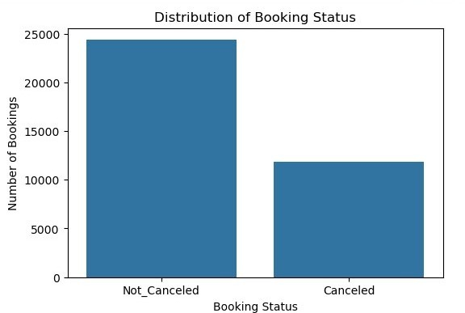
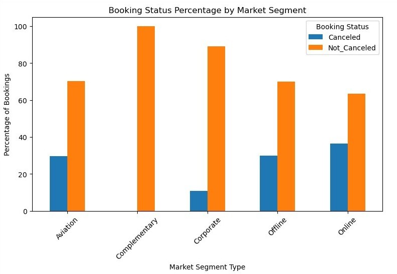
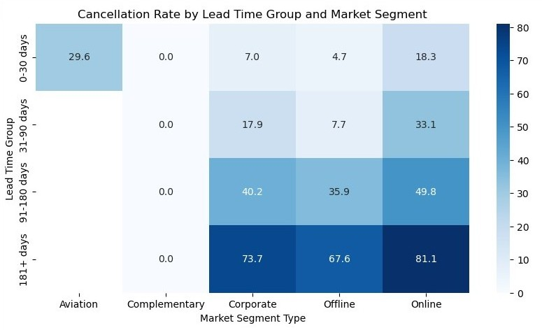
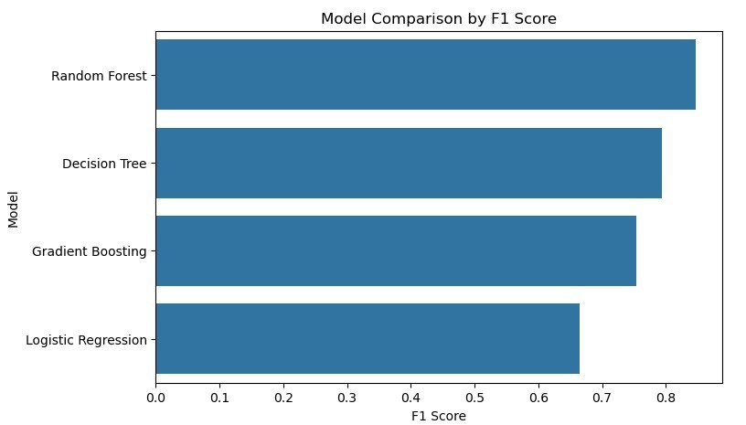
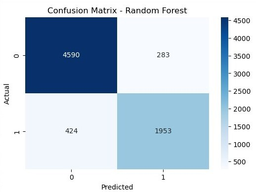
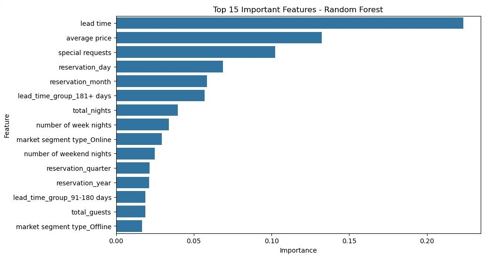

# Hotel Booking Cancellation Prediction

## Analyzing Booking Trends in the Hospitality Industry

This project analyzes historical hotel booking data for Hotel Haven, a luxury hotel chain experiencing challenges with customer booking cancellations. The goal was to explore booking patterns, identify factors linked to cancellations, and build a supervised machine learning model that can predict whether a booking is likely to be canceled.

The project was completed as a Python machine learning capstone and includes data cleaning, exploratory data analysis, feature engineering, model development, model evaluation, hyperparameter tuning, and business recommendations.

## Business Context

Hotel Haven offers different room types, meal plans, parking options, and booking channels across multiple locations. High cancellation rates can affect revenue planning, room availability, staffing, and resource allocation.

The business need was to better understand booking behavior and identify which bookings are more likely to be canceled so the hotel can respond earlier and improve customer retention strategies.

## Problem Statement

Hotel Haven struggles with booking cancellations, which can lead to:

- Lost revenue from canceled bookings
- Inefficient room and staffing plans
- Poorer resource allocation
- Limited insight into cancellation drivers
- Missed opportunities for customer retention

The key question for this project was:

**Can historical booking data be used to predict whether a customer booking will be canceled?**

## Project Objectives

- Clean and prepare the hotel booking dataset
- Explore booking and cancellation patterns
- Engineer useful features for analysis and modeling
- Build and compare supervised classification models
- Select the best-performing model
- Identify the most important predictors of cancellation
- Translate the findings into business recommendations

## Dataset Overview

The cleaned dataset contained:

- 36,248 booking records
- 25 columns after feature engineering
- Target variable: `booking_status`
- Final modeling target: `is_canceled`

The target variable was encoded as:

- `0` = Not canceled
- `1` = Canceled

Key variables included lead time, average price, market segment type, room type, special requests, reservation date, number of adults, number of children, weekend nights, and week nights.

## Tools and Libraries

- Python
- Jupyter Notebook
- pandas
- NumPy
- Matplotlib
- Seaborn
- scikit-learn

Machine learning models used:

- Logistic Regression
- Decision Tree Classifier
- Random Forest Classifier
- Gradient Boosting Classifier

## Project Workflow

### 1. Data Cleaning

The dataset was reviewed for missing values, duplicate records, and invalid values.

Key cleaning steps included:

- Checked for missing values
- Checked for duplicate rows
- Confirmed unique `Booking_ID` values
- Converted the reservation date column to datetime format
- Removed 37 invalid dates recorded as `2018-2-29`

The dataset had no missing values and no duplicate records.

### 2. Feature Engineering

New features were created to improve analysis and modeling:

- `total_nights`
- `total_guests`
- `has_children`
- `reservation_year`
- `reservation_month`
- `reservation_day`
- `reservation_day_of_week`
- `reservation_quarter`
- `lead_time_group`
- `is_canceled`

These features helped summarize booking behavior and capture time-based cancellation patterns.

### 3. Exploratory Data Analysis

The EDA explored booking patterns and relationships between variables and cancellation status.

Key areas explored included:

- Booking status distribution
- Meal plan distribution
- Room type distribution
- Market segment distribution
- Lead time distribution
- Average price distribution
- Special requests
- Cancellation rates by month, market segment, lead time group, and special requests

## Key Visuals

## Key Findings

### Lead time was the strongest cancellation-related factor

Bookings made further in advance were much more likely to be canceled. Bookings with lead times of 181+ days showed especially high cancellation risk.

### Online bookings had higher cancellation rates

Market segment was an important factor. Online bookings had the highest cancellation rate, while corporate bookings had much lower cancellation rates.

### Special requests were linked to lower cancellation risk

Bookings with more special requests were generally less likely to be canceled. This may suggest that customers who make special requests are more engaged and committed to their booking.

### Average price contributed to cancellation prediction

Average price was one of the top model features. This suggests pricing patterns may play a role in cancellation behavior.

### Reservation timing mattered

Date-related features such as reservation day and reservation month contributed to the model, suggesting that cancellation patterns varied over time.

## Model Development

The project was treated as a supervised binary classification problem.

Before modeling:

- Categorical variables were encoded using one-hot encoding
- The dataset was split into training and testing sets
- Stratified splitting was used to preserve the target distribution in both sets

Evaluation metrics included accuracy, precision, recall, F1-score, confusion matrix, and ROC-AUC. Because the business goal was to identify likely cancellations, recall and F1-score for the canceled class were especially important.

## Model Results

| Model | Accuracy | Precision | Recall | F1-score |
| --- | ---: | ---: | ---: | ---: |
| Logistic Regression | 79.8% | 72.8% | 61.3% | 66.5% |
| Decision Tree | 86.1% | 77.5% | 81.2% | 79.3% |
| Random Forest | 90.2% | 87.3% | 82.2% | 84.7% |
| Gradient Boosting | 84.9% | 80.9% | 70.5% | 75.3% |

The Random Forest model performed best overall and was selected as the final model.

## Final Model Performance

The final selected model was Random Forest.

Performance on the test set:

- Accuracy: 90.2%
- Precision for canceled bookings: 87.3%
- Recall for canceled bookings: 82.2%
- F1-score for canceled bookings: 84.7%
- ROC-AUC: 0.954

The model correctly identified most canceled bookings while maintaining a strong balance between precision and recall.

## Feature Importance

The most important predictors in the Random Forest model were:

- Lead time
- Average price
- Special requests
- Reservation day
- Reservation month
- Long lead-time group: 181+ days
- Total nights
- Online market segment

These results aligned with the EDA findings, especially the importance of lead time, market segment, special requests, and pricing.

## Business Recommendations

### 1. Monitor long lead-time bookings more closely

Bookings made far in advance, especially 181+ days before the reservation date, should be flagged for proactive follow-up.

### 2. Prioritize retention strategies for online bookings

Online bookings showed higher cancellation risk. Hotel Haven could use reminder emails, confirmation messages, or targeted incentives to encourage customers to keep their bookings.

### 3. Use special requests as an engagement signal

Customers who make special requests may be more committed to their booking. This information can help the hotel identify lower-risk bookings.

### 4. Review pricing and cancellation patterns

Since average price was an important model feature, Hotel Haven should examine whether higher-priced bookings require different retention strategies.

### 5. Use the model as an early warning tool

The Random Forest model can help identify high-risk bookings earlier, supporting better room planning, staffing, and customer retention.

## Limitations

- The model was trained on historical booking data
- Customer behavior may change over time
- Some features contain overlapping information
- Cancellation reason data was not included
- The model should be tested on newer booking data before operational use

## Next Steps

- Test the model on newer booking records
- Monitor model performance over time
- Add customer cancellation reason data if available
- Create a dashboard to track cancellation risk
- Use model predictions alongside staff judgment and business rules

## Project Files

- `Hotel_Booking_Cancellation_Prediction.ipynb`: Full data cleaning, EDA, feature engineering, modeling, evaluation, and recommendations
- `Hotel_Booking_Cancellation_Prediction_Presentation.pptx`: Business-friendly summary of the project findings
- `Booking Dataset.csv`: Historical hotel booking dataset used for analysis
- `*.jpg`: Key charts used in the presentation and README

## Skills Demonstrated

- Data cleaning
- Exploratory data analysis
- Feature engineering
- Data visualization
- Supervised machine learning
- Classification modeling
- Model evaluation
- Hyperparameter tuning
- Business problem framing
- Translating technical findings into recommendations

## Final Takeaway

This project showed that booking data can be used to identify cancellation risk and support better business planning. Lead time, market segment, special requests, average price, and reservation timing were important factors in predicting cancellations.

The final Random Forest model can help Hotel Haven identify higher-risk bookings earlier and support more proactive customer retention and resource planning.
